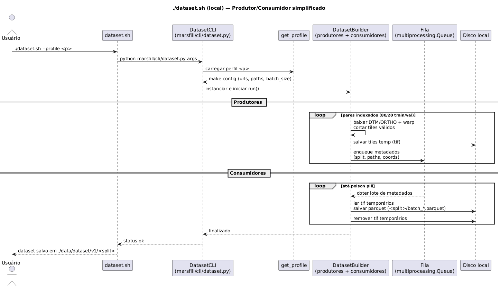

# marsfill  

[Página do projeto (coverage report)](https://b-holanda.github.io/HiRISE-DTM-FILL/)

-----

`marsfill` preenche lacunas em DTMs HiRISE usando um backbone ViT (`Intel/dpt-large`) e roda totalmente em modo local (`./data`).

## Pré-requisitos
- Linux com `wget` e `unzip` (`sudo apt-get install -y wget unzip` se faltar). `pv` é opcional.
- Miniconda/Conda.
- GPU com CUDA 12.4 recomendada (CPU funciona, só fica mais lento).
- Espaço livre: ~500 GB para rodar a validação em lote (downloads ~2.6 GB + saídas). ou 2 TB para gerar o dataset e treinar um novo modelo

## Instalação e execução rápida (validação em lote)
1) Instale Miniconda e ative:
```bash
wget https://repo.anaconda.com/miniconda/Miniconda3-latest-Linux-x86_64.sh
chmod a+x Miniconda3-latest-Linux-x86_64.sh
./Miniconda3-latest-Linux-x86_64.sh
source ~/miniconda3/bin/activate
```
2) Clone o repositório e crie o ambiente:
```bash
git clone https://github.com/b-holanda/HiRISE-DTM-FILL.git
cd HiRISE-DTM-FILL
conda env create -n marsfill-env -f environment.yml
conda activate marsfill-env
```
3) Rode tudo em lote (baixa dados de teste e modelo, gera buracos e valida):
```bash
sudo chmod a+x fill_all.sh
./fill_all.sh
```
Saídas: predições, gráficos e `batch_summary_optimized.csv` em `data/filled_batch_results/...`.

## Comandos úteis (pós-instalação)
- **Testes com coverage**  
  ```bash
  conda activate marsfill-env
  pytest --cov --cov-report=term-missing --cov-report=html
  ```
- **Inferência única** (usa download automático de dados/modelo se faltar)  
  ```bash
  sudo chmod a+x fill.sh
  ./fill.sh --profile prod \
    --dtm data/dataset/v1/test/dunes/DTEPC_088676_2540_088162_2540_A01_with_nodata.tif \
    --ortho data/dataset/v1/test/dunes/ESP_088676_2540_RED_A_01_ORTHO.JP2 \
    --gt data/dataset/v1/test/dunes/DTEPC_088676_2540_088162_2540_A01.IMG \
    --out_dir data/filled/dunes/DTEPC_088676_2540_088162_2540_A01
  ```
- **Gerar buracos sintéticos em todos os DTMs de teste**  
  ```bash
  sudo chmod a+x hole_gen.sh
  ./hole_gen.sh --profile prod
  ```
- **Dataset completo (opcional, 860 GB)**  
  ```bash
  rm -rf data
  sudo chmod a+x dataset.sh
  ./dataset.sh --profile prod   # baixa dataset.tar se ./data não existir
  ```
- **Treino (opcional; requer múltiplas GPUs para velocidade)**  
  ```bash
  rm -rf data # se for usar o dataset já gerado que está armazenado no s3
  sudo chmod a+x train.sh
  ./train.sh --profile prod
  ```
- **Lint/format**  
  ```bash
  ruff format . && ruff check .
  ```

## Arquitetura

- **Visão Geral**  
  1. **Pipeline de Dados (ETL)**: varre e baixa pares HiRISE, alinha, corta em blocos 512×512 sem NoData e salva em Parquet (train/val), mantendo pares integrais de teste.  
  2. **Treinamento (DPT-ViT)**: fine-tuning do `Intel/dpt-large` com perdas L1 + gradiente + SSIM, checkpoints em `data/models`.  
  3. **Preenchimento (Inferência + Pós-processamento)**: inferência por tiles com padding, calibração de intervalo, blending de bordas, métricas/plots e salvamento em `./data/filled`.

- **Sequência do Pipeline**  
  
  
  

- **Backbone de Profundidade (DPT-ViT)**  
  

## Resultados

- Resumo visual em `https://b-holanda.github.io/HiRISE-DTM-FILL/`.
- Destaques: 21/21 testes passando e cobertura ~67% (HTML em `htmlcov/`).

## Licença

Este projeto é licenciado sob a **Licença MIT**. Veja o arquivo `LICENSE` para mais detalhes.

## Como Citar

Se você usar `marsfill` em sua pesquisa, por favor, cite este trabalho:

```bibtex
@misc{marsfill_2025,
  author = {Bruno Rodrigues Holanda},
  title = {marsfill: Reconstrução de DTMs HiRISE com Vision Transformers},
  year = {2025},
  publisher = {GitHub},
  journal = {GitHub repository},
  howpublished = {\url{https://github.com/b-holanda/HiRISE-DTM-FILL}}
}
```
